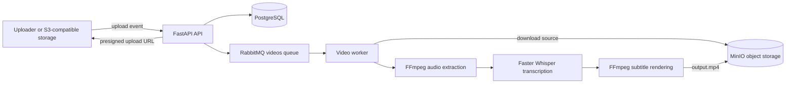

# Pierre video transcription pipline

Pierre accepts uploaded videos, extracts their audio for transcription, and produces an MP4 with the original picture, audio, and burned-in subtitles.

## Architecture



The API receives storage webhooks, records the media as `pending`, and places the object key on RabbitMQ. The worker downloads the source video, extracts a temporary audio track, transcribes it with Faster Whisper, writes an SRT file, and renders the subtitles onto the original video while preserving its audio. PostgreSQL stores media metadata and status; MinIO stores source and output objects.

## Services

| Service | Port | Purpose |
| --- | ---: | --- |
| FastAPI | `8000` | Webhook and presigned URL endpoints |
| MinIO | `9000` / `9001` | S3-compatible object storage and console |
| PostgreSQL | `5432` | Media metadata and processing status |
| RabbitMQ | `5672` / `15672` | Job queue and management console |
| Worker | — | FFmpeg processing and transcription |

## Requirements

- Docker and Docker Compose
- Python 3.14 or newer
- FFmpeg available on `PATH`
- `uv` (recommended) or another Python package manager

## Run locally

Start the infrastructure from the repository root:

```bash
docker compose up -d
```

Install the backend dependencies and start the API:

```bash
cd backend
uv sync
uv run uvicorn main:app --reload --host 0.0.0.0 --port 8000
```

In a second terminal, start the worker:

```bash
cd backend
uv run python worker.py
```

The worker and API currently connect to services through `localhost`. If they run in separate containers, use the Compose service names (`minio`, `db`, and `rabbitmq`) in their connection settings.

## API endpoints

`GET /generate-presigned-url` returns a one-hour presigned upload URL for the configured output bucket and sample object name.

`POST /upload-webhook` accepts an S3 event payload. The first record's object key is stored in PostgreSQL and published to the `videos` RabbitMQ queue.

Example webhook shape:

```json
{
  "Records": [
    {"s3": {"object": {"key": "input.mp4"}}}
  ]
}
```

## Processing output

The worker creates `subtitles.srt` and `output.mp4` in its working directory. The output is encoded as H.264 video with AAC audio and `yuv420p` pixel format for broad playback compatibility. Subtitles are burned into the video frames, so a separate subtitle track is not required by the player.

Connection credentials and service addresses are currently defined in the Python modules and `docker-compose.yml`; move them to environment variables before deploying beyond local development.
